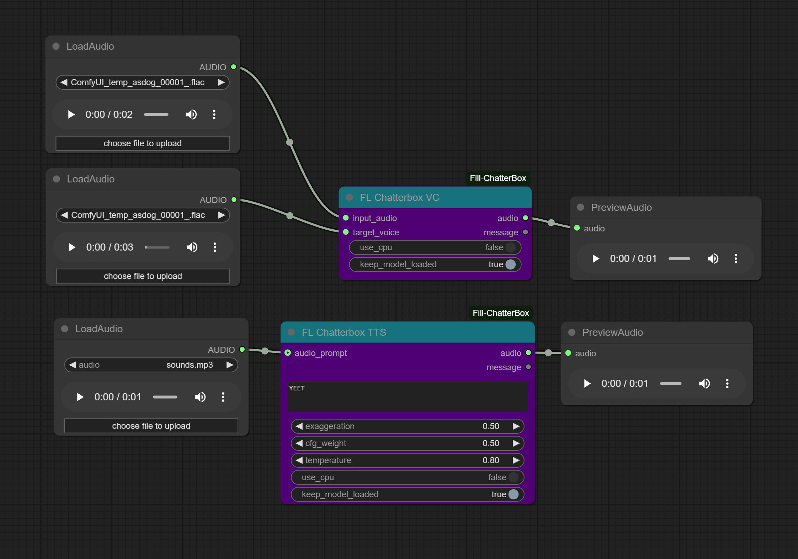

# ComfyUI_Fill-ChatterBox

A custom node extension for ComfyUI that adds text-to-speech (TTS) and voice conversion (VC) capabilities using the Chatterbox library.



## Installation

1. Clone this repository into your ComfyUI custom_nodes directory:
   ```bash
   cd /path/to/ComfyUI/custom_nodes
   git clone https://github.com/filliptm/ComfyUI_Fill-ChatterBox.git
   ```

2. Install the base dependencies:
   ```bash
   pip install -r ComfyUI_Fill-ChatterBox/requirements.txt
   ```


## Usage

### Text-to-Speech Node (FL Chatterbox TTS)
- Add the "FL Chatterbox TTS" node to your workflow
- Configure text input and parameters (exaggeration, cfg_weight, temperature)
- Optionally provide an audio prompt for voice cloning

### Voice Conversion Node (FL Chatterbox VC)
- Add the "FL Chatterbox VC" node to your workflow
- Connect input audio and target voice
- Both nodes support CPU fallback if CUDA errors occur

## Change Log

### 5/31/2025
- Added Persistent model loading, and loading bar functionality
- Added Mac support (needs to be tested so HMU)